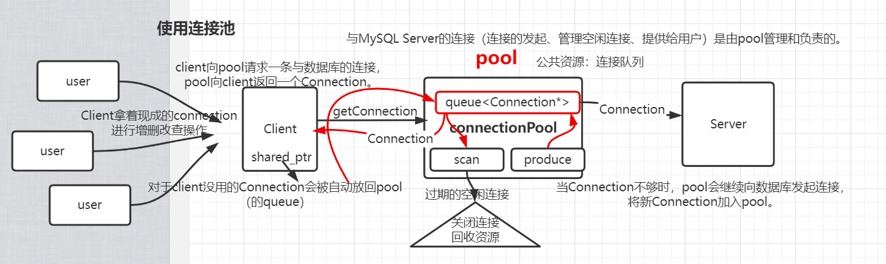
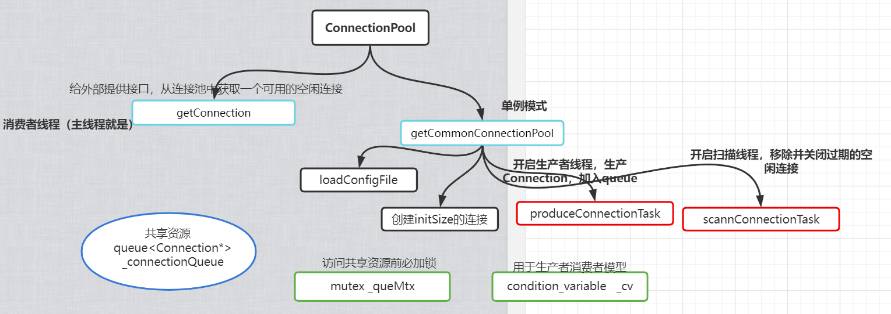
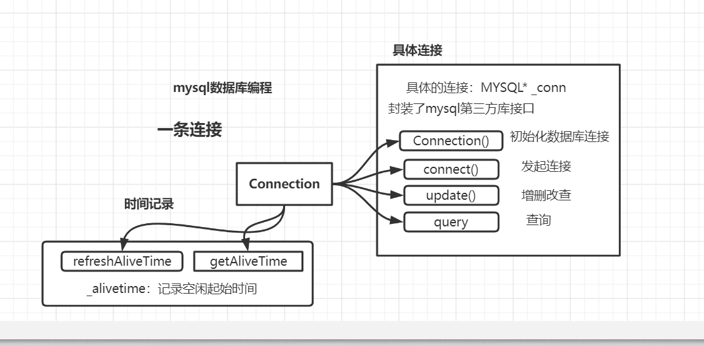

# ConnectionPool
- CommonConnectionPool实现 C++11风格
## 环境
- VS
- 使用mysql提供的第三方库
## 收获
- 了解MySQL数据库编程、熟练单例模式、queue队列容器、C++11多线程编程、线程互斥、线程同步通信、unique_lock、基于CAS的原子整形、智能指针shared_ptr、lambda表达式、生产者-消费者线程模型

## 图示

- 整体

- ConnectionPool

- Connection

